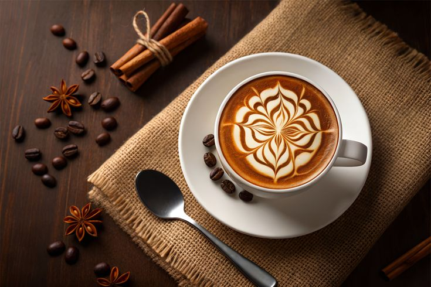

  <h1>☕ Bahuchar Tea Stall</h1>
  
<em>Experience premium beverages and a cozy ambience in Palanpur's finest Tea Stall.</em>

  
  

---

## 🌟 Overview

**Bahuchar Tea Stall** is a modern, highly-aesthetic website showcasing an exquisite menu of hot teas, cold coffees, and refreshing summer drinks. Operating since 2026, the stall serves the local community of Palanpur with passion.

This project is a fully responsive landing page designed with a sleek, glassmorphic UI and a soothing dark-green/cream color palette to ensure a premium feel across all platforms.

 

## ✨ Key Features

- **📱 Fully Responsive:** Flawlessly adapts to mobile, tablet, and desktop screens using modern CSS Grids.
- **🎨 Premium Aesthetic:** A curated palette of deep matcha greens (`#2D3A31`), sleek ivories (`#FFFCF7`), and warm peach accents (`#E89B6F`).
- **🌙 Glassmorphism:** Clean, translucent navigation and contact cards for a modern appeal.
- **⚡ Blazing Fast:** Local, high-quality generated imagery providing an optimal, layout-shift-free loading experience.
- **🔍 SEO Ready:** Structurally sound with semantic HTML `<main>` tags, Open Graph meta tags, and rich descriptions.

 

## 🍰 Our Menu Highlight

* **Hot Teas:** Masala Chai, Ginger Tea, Green Tea, Herbal Tea
* **Cold Drinks:** Cold Coffee, Iced Lemon Tea, Iced Mint Tea, Cold Brew

 

## 🛠️ Technology Stack

1. **HTML5:** Semantic, clean structure
2. **CSS3:** Advanced flexbox/grid layouts, keyframe animations, and custom styling
3. **Vanilla JavaScript:** DOM manipulations and smooth scrolling interactions

 

## 📬 Connect With Us

- 📍 **Location:** Palanpur Tea Street, Coffee City
- 📞 **Phone:** +91 7096609708
- 📘 **Facebook:** [aelliya.yuvraj](https://www.facebook.com/aelliya.yuvraj/)
- 📷 **Instagram:** [@yuvi_xii](https://www.instagram.com/yuvi_xii/)

---

  
Designed with Peace ✌️ | © 2026 Bahuchar Tea Stall

